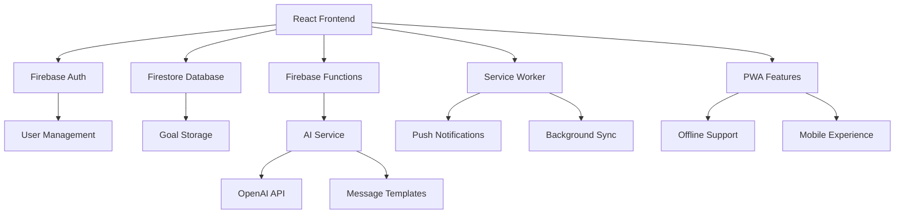

# 🎯 GOALRING - The Anti-Distraction Goal Reminder

---

## 🌟 **What is GOALRING?**

GOALRING is a revolutionary **Progressive Web Application** that helps you stay focused on your goals by sending intelligent, AI-powered notifications when you're browsing distracting websites. It's like having a personal accountability coach that knows exactly when you need motivation the most.

### 🎯 **The Problem**
- **Social media addiction** is stealing our productivity
- **Goal abandonment** due to lack of consistent reminders
- **Generic motivation** that doesn't resonate with personal goals
- **No intelligent timing** for when reminders are most effective

### ✨ **The Solution**
GOALRING combines **AI-powered personalization** with **smart timing** to deliver the right motivation at the right moment, helping you break free from distractions and achieve your goals.

---

## 🚀 **Key Features**

### 🤖 **AI-Powered Motivation**
- **Personalized Messages**: AI generates custom motivational content based on your specific goals
- **Multiple Styles**: Choose from Deep, Harsh, or Encouraging motivational tones
- **Smart Context**: Messages adapt to your goal category (fitness, study, career, etc.)
- **182+ Templates**: Extensive library of proven motivational content

### 🔔 **Intelligent Notifications**
- **Configurable Intervals**: Set reminders from 5 minutes to 24 hours
- **System-Level Alerts**: Browser notifications that work even when the app is closed
- **Quick Reminders**: Temporary notifications with countdown timers
- **Background Processing**: Service worker ensures notifications work offline

### 🎯 **Comprehensive Goal Management**
- **9 Goal Categories**: Fitness, Study, Productivity, Personal, Career, Relationships, Financial, Mental Health, Creativity
- **Visual Category Selector**: Intuitive icon-based category picker
- **Progress Tracking**: Mark goals as complete with visual feedback
- **Real-time Sync**: Instant updates across all devices

### 🔐 **Secure & Reliable**
- **Multi-Auth Support**: Email/Password, Google OAuth, and Anonymous login
- **Firestore Security**: User-based data isolation and protection
- **Offline Capability**: Works without internet connection
- **Error Handling**: Robust error management throughout

---

## 🛠️ **Tech Stack**

### **Frontend**
- **React 18.2.0** - Modern functional components with hooks
- **React Router DOM 6.22.1** - Client-side routing
- **Material-UI** - Professional design system
- **React Hot Toast** - Elegant notifications

### **Backend & Database**
- **Firebase 11.6.0** - Complete backend-as-a-service
- **Firestore** - Real-time NoSQL database
- **Firebase Authentication** - Multi-method auth system
- **Firebase Cloud Functions** - Serverless backend logic
- **Firebase Hosting** - Global CDN deployment

### **AI & Intelligence**
- **OpenAI API** - GPT-powered message generation
- **Mistral 7B Instruct** - Advanced language model
- **Custom Message Templates** - 182+ curated motivational content
- **Smart Fallback System** - Reliable message delivery

### **Notifications & PWA**
- **Firebase Cloud Messaging** - Push notifications
- **Service Worker** - Background processing
- **Browser Notifications API** - System-level alerts
- **Progressive Web App** - Mobile app-like experience

---

## 📸 **Screenshots**

## 🏗️ **Architecture Overview**

## 🎯 **Use Cases**

### 👨‍🎓 **Students**
- Study reminders and academic goal tracking
- Exam preparation motivation
- Assignment deadline alerts

### 💼 **Professionals**
- Career development goals
- Productivity enhancement
- Skill learning reminders

### 💪 **Fitness Enthusiasts**
- Workout schedule adherence
- Health goal tracking
- Nutrition reminders

### 🧘 **Personal Development**
- Habit formation support
- Life improvement goals
- Mindfulness practice reminders

### **Key Services**
- **`aiService.js`** - AI message generation and management
- **`notificationService.js`** - Notification scheduling and delivery
- **`messageMatcher.js`** - Template matching and personalization
- **`notificationUtils.js`** - Notification utilities and cleanup

    

---

## 👨‍💻 **About the Developer**

**Marjane** - Full-Stack Developer & AI Enthusiast

- 🔗 **Portfolio**: [Your Portfolio Link]
- 💼 **LinkedIn**: [Your LinkedIn Profile]
- 🐦 **Twitter**: [Your Twitter Handle]
- 📧 **Email**: [Your Email]

### **Skills Demonstrated**
- **Frontend**: React, Material-UI, PWA Development
- **Backend**: Firebase, Cloud Functions, NoSQL
- **AI/ML**: OpenAI Integration, Natural Language Processing
- **DevOps**: CI/CD, Firebase Deployment, Performance Optimization
- **UX/UI**: Responsive Design, User Experience, Accessibility

---

## 🙏 **Acknowledgments**

- **OpenAI** for providing the AI capabilities
- **Firebase** for the robust backend infrastructure
- **React Team** for the amazing frontend framework
- **Material-UI** for the beautiful design system

---

### ⭐ **Star this repository if you found it helpful!**

**Built with ❤️ and lots of ☕**

